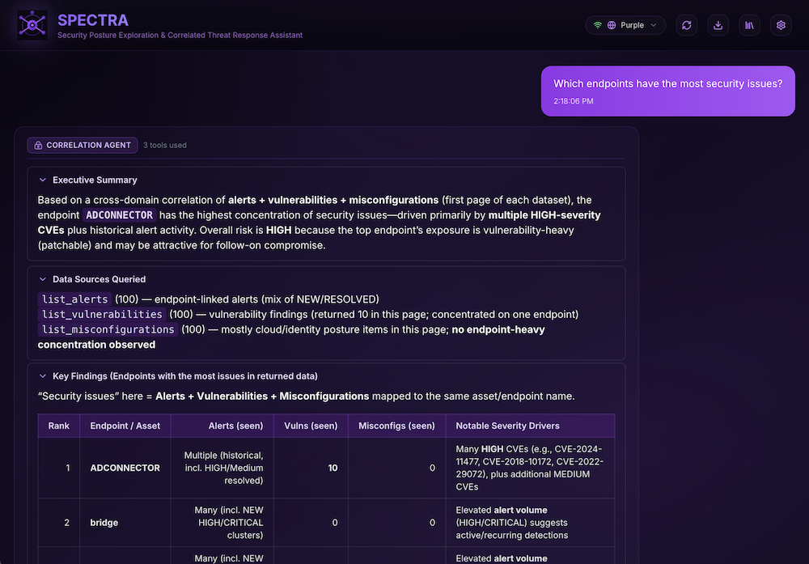

<p align="center">
  
</p>

# SPECTRA

**S**ecurity **P**osture **E**xploration & **C**orrelated **T**hreat **R**esponse **A**ssistant


---

## 🆕 What's new in **v1.3 — April 2026**

**Investigations become briefings.**

v1.3 adds a full MARP slide-deck pipeline that renders any SPECTRA
conversation as an executive briefing — exportable as a standalone HTML
file, optionally packaged inside a Case Bundle, or presented live in
full-screen from the app.

### Highlights

- **🎞️ Brief this case (one-click).** New toolbar button renders the
  current conversation as an executive deck and downloads a
  self-contained `*.html` file: cover → executive summary → per-agent
  findings → evidence gallery → MITRE ATT&CK kill-chain → recommended
  actions → appendix. Image evidences are inlined as data URLs so the
  file works offline (open, then *Print → Save as PDF* from the browser
  for a PDF copy — the exported HTML ships with `print-color-adjust:
  exact` so gradients, the purple theme, the logo watermark and all
  backgrounds survive the browser's *Background graphics = off* default).
  Powered by `@marp-team/marpit` with a custom SPECTRA purple theme and
  the SPECTRA logo embedded as an inline SVG data URI; everything runs
  client-side.
- **📦 MARP inside Case Bundles.** The Case Bundle export modal now has a
  *MARP slide deck (HTML)* checkbox — when ticked, `deck.html` is added
  to the ZIP alongside `conversation.md`, `conversation.pdf`,
  `messages.json` and the `evidences/` folder. Useful for handover ZIPs
  that include both the full evidence trail and a ready-to-present
  summary.
- **🎤 Present mode ("Threat story").** A dedicated toolbar button opens
  a full-screen slide show that renders the same deck inside the app.
  Keyboard bindings: `← / →` or `PageUp / PageDown` to navigate, `Home /
  End` to jump, `B` to blank the screen (for questions), `S` to toggle
  speaker notes, `Esc` to exit. The stage auto-scales to the viewport
  while preserving the 16:9 aspect ratio.
- **✍️ Smart deck titles.** When you click *Brief* or *Present*, SPECTRA
  scans the transcript for threat-vocabulary keywords and capitalised
  proper nouns to pre-fill a suggested title (e.g. *Investigation —
  Apollo Ransomware*, *Investigation — Salt Typhoon Campaign*). A single
  prompt lets you accept or override it; the chosen title drives the
  cover slide, the downloaded filename, and the Present-mode chrome.
- **📐 Block-aware pagination (no overflow, no orphans).** The renderer
  tokenises each section into atomic blocks — headings, paragraphs,
  lists, tables, fenced code, blockquotes — assigns each a realistic
  visual weight, and packs them greedily onto slides. Tables and code
  fences are never split mid-way, headings are never separated from
  their body, empty continuation slides are suppressed, and long
  sections flow automatically onto `(cont.)` slides instead of being
  silently clipped under the page counter.
- **🛠️ Tools used, in the slide footer.** Each finding slide carries a
  `Tools: alert_triage · correlation · threat_hunt` strip in the bottom-
  left chrome, tying the slide's content to the exact MCP tools that
  produced it. Repeated on continuation slides so viewers never have to
  flip back for provenance.
- **🎭 Human-readable agent names.** Agent handles are displayed in
  Title Case throughout the deck (`alert_triage` → *Alert Triage*,
  `threat_hunt` → *Threat Hunt*, `purple_ai` → *Purple AI*, …) via a
  central alias map, with a generic Title-Case fallback for unknown
  handles.
- **🧠 Speaker notes from thought process.** The Present view lifts each
  assistant turn's `thoughtProcess` (classification + reason + tool
  calls) into a speaker-notes overlay the presenter sees but the audience
  doesn't — perfect for tabletop walk-throughs or purple-team readouts.
- **🎯 Zone-aware deck extraction.** Slides reuse the same
  `classifyZone()` heuristics as the chat UI, so "Executive Summary" /
  "Summary" / "TL;DR" sections populate the exec slide automatically,
  "Recommended Actions" / "Remediation" populate the actions slide, and
  everything else becomes per-agent findings slides. No manual tagging
  required in the conversation.
- **🪄 MITRE ATT&CK kill-chain mapping.** The renderer scrapes `Txxxx`
  and `Txxxx.yyy` technique ids from the conversation and assembles a
  clickable kill-chain slide grouped by tactic in canonical
  Reconnaissance → Impact order; each chip deep-links to
  `attack.mitre.org`.

### Dependency added

- `@marp-team/marpit ^3.1.2` in the frontend (small, MIT, pure-JS).

### Upgrading from v1.2

1. `git pull && docker compose build frontend && docker compose up -d`
2. No storage migration required — decks are rendered on demand from the
   same conversation + evidence data already in IndexedDB/localStorage.

---

## 🆕 What's new in **v1.2 — April 2026**

**Conversations become investigation case files.**

v1.2 turns a SPECTRA "conversation" from a pure chat log into a full
investigation artefact: you can **upload evidences** (binaries, JSON, logs,
ZIPs, images, PCAPs, screenshots, …), export the whole thing as a portable
**Case Bundle (ZIP)**, and steer the visual density of the chat with a new
**Zones** toolbar.

### Highlights

- **📎 Evidence uploads.** Drag-and-drop onto the composer, paste a screenshot,
  or click the paperclip. Files are stored **entirely in your browser**
  (IndexedDB) against the current conversation. Binaries, logs, PCAPs, JSON,
  ZIPs, images — all supported. Small text/JSON files (≤ 64 KB) are
  automatically inlined into the LLM's context so the agent can actually
  reason over their contents; larger / binary files are referenced by name,
  size, MIME and SHA-256 to avoid token bloat.
- **📦 Case Bundle export (ZIP).** New toolbar button opens an export modal
  with per-section checkboxes: **Markdown conversation** (always on), **PDF**,
  **agent artefacts** (thought process + tool calls as JSON), **uploaded
  evidences** (originals + per-file `.meta.json` sidecars), and an optional
  **redact secrets** pass. Every bundle includes a canonical `messages.json`
  (redacted inline when the toggle is on) that makes it **round-trippable**
  on import. The bundle also ships
  with `manifest.json` (schema version + SHA-256 checksums) and a
  human-readable `README.txt`. Assembled client-side with
  [`fflate`](https://github.com/101arrowz/fflate); no bytes touch the backend.
- **📥 Case Bundle import.** The Investigation Library now has an **Import
  bundle** button. Drop any `.zip` produced by SPECTRA and the importer
  validates the manifest, verifies SHA-256 checksums per evidence, restores
  the conversation from `messages.json`, and re-inserts every evidence into
  IndexedDB (deduping by SHA-256). If an investigation with the same id
  already exists, a conflict dialog lets you **keep both** (rename incoming),
  **replace** the existing one, or **cancel**. Bundles without `messages.json`
  (pre-v2 exports only — the current exporter always writes it) fall back to
  parsing `conversation.md` — message text round-trips, but thought process,
  tool calls and evidence links are not recovered and the UI flags this as a
  **degraded import**.
- **🧭 Chat Zones.** A sticky toolbar above the chat lets you expand or
  collapse *categories* across every message in one click: **Exec**
  (executive summaries / TL;DR), **Actions** (recommended actions /
  remediation), **Findings** (everything else), **Thoughts** (per-message
  thought process), **Tools** (tool-call list), **Evidence**. Presets include
  *Expand all*, *Collapse all*, *Only exec*, *Exec + actions*. Per-card
  clicks still work and are remembered until the next preset.
- **➕ One-click New Conversation.** A dedicated toolbar button starts a fresh
  conversation with a new evidence container, without touching the library.
- **🧠 Evidence-aware LLM.** The user turn sent to the model is transparently
  augmented with the attached evidence. Small text is inlined in fenced code
  blocks; every file gets a metadata line (name, MIME, size, short SHA-256).
  Vision-model payloads for images are staged for the next release.
- **🖼️ Browser-owned storage.** True to the v1.1 contract, evidences live in
  IndexedDB only — the backend never sees them (and never persists anything
  about them). They are bound to the investigation id, so saving a
  conversation from the library keeps evidences linked without a migration
  step.
- **📝 MARP slide export — on the roadmap.** Design notes parked in
  [`docs/MARP_IDEAS.md`](docs/MARP_IDEAS.md). Upcoming: one-click executive
  deck (Idea A) and full-screen "Threat story" presentation mode (Idea B).

### Dependency added

- `fflate ^0.8.2` in the frontend (small, pure-JS, streaming ZIP assembler).

### Upgrading from v1.1

1. `git pull && docker compose build && docker compose up -d`
2. The frontend image will be rebuilt with the new `fflate` dependency.
3. Clear site data only if your browser reports a stale IndexedDB schema —
   otherwise existing investigations are preserved.
4. No backend changes required; the Case Bundle is assembled entirely in the
   browser.

---

## 🆕 What's new in **v1.1 — April 2026**

**Multi-tenant, horizontally scalable, browser-owned state.**

SPECTRA v1.1 is a major architectural upgrade that turns the previously single-tenant deployment into a shared service that 20–30 SOC analysts can use independently from a single Docker stack — each with their own consoles, API keys, LLM settings, and investigation library.

### Highlights

- **👤 Multi-user, no login required.** Every browser is its own tenant. State is keyed by a per-browser session UUID generated lazily on first visit; nothing is shared between users on the same backend.
- **💾 Browser-owned state.** Consoles, SentinelOne API tokens, LLM provider/key/model, and the entire investigation library live in `localStorage`. The backend stores **zero** user data and is fully restartable without losing user config.
- **🔐 Encrypted Vault export/import.** A new **Settings → Vault & Privacy** tab lets you export your entire state as a passphrase-encrypted JSON file (AES-GCM-256 + PBKDF2-SHA256 with 600 000 iterations, all via the browser's Web Crypto API). Restore from any browser/device by importing the same file. A plain-text export is also available behind a confirmation prompt.
- **🛡️ Sensitive Mode.** Optional toggle that keeps API keys and console tokens in browser memory only — wiped on reload. Useful on shared / kiosk machines.
- **⚖️ Horizontal scalability.** The backend is functionally stateless. It maintains an in-memory per-session `MCPClient` cache (TTL-evicted, LRU-capped) only as a connection-reuse optimization. Tunable via env vars: `WEB_CONCURRENCY`, `SPECTRA_MAX_SESSIONS`, `SPECTRA_SESSION_TTL`, `SPECTRA_MAX_CONCURRENT_MCP`. Run `docker compose up --scale backend=N` behind nginx for additional capacity.
- **🧱 Per-session MCP isolation.** Each browser holds its own JSON-RPC session with Purple MCP via a process-wide semaphore that protects upstream from thundering-herd traffic.
- **🧾 One-shot legacy migration.** The first browser to load a freshly upgraded v1.1 backend automatically inherits any pre-v1.1 `settings.json` / `destinations.json` / `investigations.json` files. Disable with `SPECTRA_LEGACY_BOOTSTRAP=0`.
- **🔒 Hardened defaults.** Strict Content-Security-Policy from nginx (no inline scripts, `connect-src 'self'`, `frame-ancestors 'none'`), `X-Frame-Options: DENY`, `Referrer-Policy: no-referrer`, `Cache-Control: no-store` on every `/api/*` response, and a backend log redactor that strips API keys and bearer tokens before they reach the in-memory log buffer or `/api/logs`.
- **🧠 Live "thinking" timeline.** Instead of a bland spinner, every query shows a real-time step-by-step trace of what the backend is doing (connecting to MCP, discovering tools, classifying intent, routing to specialists, calling each tool, synthesizing) with per-step durations, spinner → check / × transitions, and zero round-trips — all delivered over SSE.
- **🔁 Live model discovery.** Settings → LLM Configuration → **Refresh from API key** queries the provider (OpenAI, Anthropic, Google) and replaces the static model list with the ones your key can actually invoke. The key is used for exactly one outbound call and never persisted or logged.
- **🩺 Friendly network errors.** Low-level failures (`[Errno -5] No address associated with hostname`, `ConnectError`, timeouts, TLS problems) are translated into actionable markdown messages naming the exact host that failed and how to fix it. The default Docker Compose now ships with `dns: [1.1.1.1, 8.8.8.8]` on the backend so hostnames resolve reliably out of the box.

### Breaking changes

- The backend `settings.json`, `destinations.json` and `investigations.json` files are no longer used at runtime. They are read **once** by `/api/legacy/bootstrap` and then become inert. The Docker volume `spectra-config` is now optional.
- These endpoints have been removed: `GET/POST /api/settings`, `GET/POST/PUT/DELETE /api/destinations*`, `GET/POST/DELETE /api/investigations*`. All of that data is now browser-side.
- `GET /api/mcp-health`, `POST /api/tools`, `POST /api/tool`, `POST /api/query`, `POST /api/purple-ai` now require the `X-Spectra-Session-Id` header and a `session_config` payload in the request body.
- The `MCP_SERVER_URL` env var (single-tenant default) is no longer consulted; each browser configures its own per-console MCP URL.

### Upgrading from v1.0

1. `git pull && docker compose build && docker compose up -d`
2. Open SPECTRA in your browser — if `localStorage` is empty and the legacy files exist on the volume, your previous configuration loads automatically. Open **Settings → Vault & Privacy → Encrypted Export** and save your first vault file.
3. (Optional) On hardened deployments, set `SPECTRA_LEGACY_BOOTSTRAP=0` and remove the `spectra-config` volume mount.

---

## Overview

SPECTRA is an AI-powered security investigation assistant that provides SOC analysts with a conversational interface to query, correlate, and analyze security data from SentinelOne. It leverages the power of Large Language Models (LLMs) combined with SentinelOne's Purple AI and the Model Context Protocol (MCP) to deliver intelligent, context-aware security insights.

<p align="center">
  
</p>

### What Can SPECTRA Do?

- **Natural Language Threat Hunting**: Ask questions like *"Show me critical alerts from the last 24 hours"* or *"What vulnerabilities affect my production servers?"*
- **Cross-Domain Correlation**: Automatically correlate alerts, vulnerabilities, misconfigurations, and asset inventory to provide comprehensive security context
- **Agentic Investigation**: The AI autonomously decides which tools to call, chains multiple queries, and synthesizes findings into actionable SOC reports
- **Visual Data Representation**: Tables with numeric data automatically offer pie/bar chart visualizations; Mermaid diagrams from Purple AI render as interactive charts
- **Professional Reporting**: Export complete investigations as branded PDF reports with charts, tables, and full conversation history
- **Investigation Library**: Save, load, and continue investigations across sessions

---

## Features

| Feature | Description |
|---------|-------------|
| **Agentic AI** | LLM function calling enables autonomous tool selection and multi-step result chaining |
| **Conversation Context** | Full chat history maintained for contextual follow-up questions |
| **Data Correlation** | Correlates alerts, vulnerabilities, misconfigurations, and inventory |
| **Multi-Provider LLM** | Support for OpenAI, Anthropic Claude, and Google Gemini |
| **PDF Export** | Export investigations as branded PDF reports with charts and tables |
| **Chart Visualizations** | Automatic pie/bar charts for tabular data and Mermaid diagram rendering |
| **Investigation Library** | Save, load, rename, and continue investigations |
| **Multi-Destination** | Configure multiple SentinelOne console connections per browser |
| **Multi-Tenant** *(v1.1)* | 20–30 independent users on a single Docker stack, each with isolated state |
| **Browser-Owned State** *(v1.1)* | Consoles, API keys, library all stored in `localStorage` — backend is stateless |
| **Encrypted Vault** *(v1.1)* | Passphrase-encrypted export/import (AES-GCM-256 + PBKDF2 via Web Crypto) |
| **Sensitive Mode** *(v1.1)* | In-memory secrets only — wiped on reload |
| **Horizontal Scalability** *(v1.1)* | `docker compose up --scale backend=N` behind nginx |
| **Thinking Timeline** *(v1.1)* | Real-time SSE-driven step list with per-step durations |
| **Live Model Discovery** *(v1.1)* | One-click refresh lists models your API key can actually invoke |
| **Friendly Network Errors** *(v1.1)* | DNS / connect / TLS failures translated into actionable messages |
| **Evidence Uploads** *(v1.2)* | Drag-drop / paste / pick files — stored in IndexedDB, bound to the conversation |
| **Case Bundle Export** *(v1.2)* | Single ZIP with Markdown + optional PDF + agent artefacts + original evidences + manifest |
| **Case Bundle Import** *(v1.2)* | Re-hydrate any SPECTRA ZIP: validates SHA-256, dedupes evidences, conflict resolution dialog |
| **Chat Zones** *(v1.2)* | One-click expand/collapse categories (Exec, Actions, Findings, Thoughts, Tools, Evidence) |
| **Evidence-aware LLM** *(v1.2)* | Small text/JSON inlined into the model's context; binaries referenced by metadata |
| **MARP Brief Export** *(v1.3)* | One-click 7-slide executive deck (HTML) with SPECTRA theme + inlined image evidences |
| **MARP Present Mode** *(v1.3)* | Full-screen in-app slide show with keyboard nav, blank-screen, speaker notes |
| **Speaker Notes** *(v1.3)* | Notes auto-filled from each assistant turn's thought process (classification, reason, tools) |
| **Auto MITRE Grid** *(v1.3)* | Technique ids scraped from the conversation and rendered as a dedicated slide |
| **Modern UI** | Purple-themed glass morphism design with responsive layout |

---

## Prerequisites

> **⚠️ IMPORTANT: Purple-MCP Dependency**
>
> SPECTRA requires a running instance of **[Purple-MCP](https://github.com/sentinel-one/purple-mcp)** to function. Purple-MCP is the Model Context Protocol server that provides the tools for querying SentinelOne data.
>
> **You must have Purple-MCP running before starting SPECTRA.**

### Required Components

1. **Purple-MCP Server** - Running and accessible (default: `http://localhost:8000`)
2. **LLM API Key** - From OpenAI, Anthropic, or Google
3. **Docker & Docker Compose** - For running SPECTRA
4. **SentinelOne Console Access** - API token with appropriate permissions

---

## Architecture

```
┌─────────────────────────────────────────────────────────────────────────────────────┐
│                                    SPECTRA Stack                                     │
└─────────────────────────────────────────────────────────────────────────────────────┘

    ┌───────────────┐         ┌───────────────┐         ┌───────────────┐
    │   Browser     │         │   SPECTRA     │         │   SPECTRA     │
    │               │  HTTP   │   Frontend    │  HTTP   │   Backend     │
    │  User @ :3000 │◀───────▶│   (React)     │◀───────▶│   (FastAPI)   │
    │               │         │   Port 3000   │         │   Port 8080   │
    └───────────────┘         └───────────────┘         └───────┬───────┘
                                                                │
                              ┌─────────────────────────────────┼─────────────────────┐
                              │                                 │                     │
                              │                                 ▼                     │
                              │                         ┌───────────────┐             │
                              │          SSE/HTTP       │  Purple-MCP   │             │
                              │         ◀──────────────▶│   Server      │             │
                              │                         │   Port 8000   │             │
                              │                         └───────┬───────┘             │
                              │                                 │                     │
                              │     EXTERNAL DEPENDENCY         │                     │
                              │     (Must be running)           │                     │
                              └─────────────────────────────────┼─────────────────────┘
                                                                │
                    ┌───────────────────────────────────────────┴───────────────────┐
                    │                                                               │
                    ▼                                                               ▼
            ┌───────────────┐                                               ┌───────────────┐
            │  SentinelOne  │                                               │  LLM Provider │
            │  Console API  │                                               │  (OpenAI /    │
            │  + Purple AI  │                                               │  Claude /     │
            │               │                                               │  Gemini)      │
            └───────────────┘                                               └───────────────┘
```

### Data Flow

1. **User submits query** → Frontend sends to Backend
2. **Backend invokes LLM** with conversation history + available MCP tools
3. **LLM decides tool calls** → Backend executes via Purple-MCP (SSE)
4. **Purple-MCP queries** SentinelOne APIs and Purple AI
5. **Results returned to LLM** → LLM synthesizes response
6. **Final response** displayed in Frontend with charts/tables

---

## Quick Start

### 1. Start Purple-MCP First

```bash
# In the purple-mcp directory
cd purple-mcp
python -m purple_mcp.server
# Server will start on http://localhost:8000
```

### 2. Build and Run SPECTRA

#### Option A: Run with Console Output (Development/Debugging)

```bash
cd spectra
docker compose up --build
```

This keeps the terminal attached so you can see real-time logs from both frontend and backend containers. Press `Ctrl+C` to stop.

#### Option B: Run as Daemon (Production)

```bash
cd spectra
docker compose up --build -d
```

The `-d` flag runs containers in detached mode (background). 

**View logs when running as daemon:**
```bash
# All containers
docker compose logs -f

# Backend only
docker compose logs -f backend

# Frontend only
docker compose logs -f frontend
```

**Stop the daemon:**
```bash
docker compose down
```

### 3. Access SPECTRA

Open your browser to **http://localhost:3000**

### 4. Configure Settings

1. Click the **⚙️ Settings** gear icon in the header
2. Configure your **LLM Provider** and **API Key**
3. Set the **MCP Server URL** (default: `http://host.docker.internal:8000`)

---

## Environment Variables (Optional)

You can pre-configure SPECTRA using environment variables before running Docker:

```bash
export MCP_SERVER_URL=http://host.docker.internal:8000
export OPENAI_API_KEY=sk-...
export LLM_PROVIDER=openai
export LLM_MODEL=gpt-5.2

docker compose up --build -d
```

Or configure everything via the Settings UI after startup.

## Settings Reference

Access settings via the **⚙️ gear icon** in the header. Settings are persisted in a Docker volume.

### General Tab

| Setting | Description | Default |
|---------|-------------|---------|
| **MCP Server URL** | URL where Purple-MCP is running | `http://host.docker.internal:8000` |
| **LLM Provider** | AI model provider (OpenAI, Anthropic, Google) | OpenAI |
| **API Key** | API key for the selected provider | — |
| **Model** | Model to use (dropdown shows models for selected provider) | `gpt-5.2` |

**Available Models by Provider:**

| Provider | API Key Required | Models |
|----------|------------------|--------|
| **OpenAI** | OpenAI API key | `gpt-5.2`, `gpt-5.1`, `gpt-5`, `gpt-5-mini`, `gpt-5-nano` |
| **Anthropic** | Anthropic API key | `claude-opus-4.6`, `claude-sonnet-4.5`, `claude-sonnet-4` |
| **Google** | Google AI API key | `gemini-3-pro-preview`, `gemini-3-flash-preview`, `gemini-2.5-flash`, `gemini-2.5-pro` |

---

## Available MCP Tools

The LLM can autonomously invoke these tools based on your queries:

| Tool | Description |
|------|-------------|
| `list_alerts` | Get security alerts with severity, status, endpoints |
| `get_alert` | Get detailed info for a specific alert |
| `list_vulnerabilities` | Get CVEs and vulnerability findings |
| `list_misconfigurations` | Get cloud/K8s security misconfigurations |
| `list_inventory_items` | Get asset inventory (endpoints, apps, users) |
| `purple_ai` | Natural language threat hunting queries via Purple AI |
| `powerquery` | Execute PowerQuery for behavioral/telemetry analysis |

---

## Investigation Library

Save and manage your investigations for later review or continuation:

- **Save Investigation**: Click the 💾 icon → Enter a name → Investigation saved
- **Load Investigation**: Click the 📚 Library icon → Select an investigation → Conversation restored
- **Rename**: Click the ✏️ pencil icon next to any saved investigation
- **Delete**: Click the 🗑️ trash icon to remove an investigation
- **Continue**: Load a saved investigation and continue asking questions

Investigations are stored server-side and persist across browser sessions.

---

## PDF Export

Click the **📥 Download** button to export the current investigation as a branded PDF report:

| Feature | Description |
|---------|-------------|
| **SPECTRA Branding** | Custom logo and purple-themed header on every page |
| **Full Conversation** | Complete Q&A history with timestamps |
| **Tables** | Properly formatted markdown tables with borders |
| **Charts** | Pie charts captured as high-quality images |
| **Page Numbers** | Footer with page numbers and "Powered by" attribution |

---

## Troubleshooting

### Viewing Logs

SPECTRA includes a built-in log viewer. Click the **⚙️ Settings** gear icon and scroll down to the **Logs** section to view recent backend activity and diagnose issues.

### Resetting Configuration

To clear all settings and start fresh:

```bash
docker compose down -v   # -v removes volumes
docker compose up --build
```

---

## Development

### Run Frontend Locally

```bash
cd frontend
npm install
npm run dev
# Runs on http://localhost:5173
```

### Run Backend Locally

```bash
cd backend
pip install -r requirements.txt
uvicorn main:app --reload --port 8080
```

### Docker Volumes

Configuration is persisted in the `spectra-config` volume:
- MCP Server URL
- LLM Provider and API Key  
- LLM Model selection
- Saved investigations

---

## API Reference

| Endpoint | Method | Description |
|----------|--------|-------------|
| `/api/query` | POST | Execute natural language query |
| `/api/settings` | GET/POST | Get/update configuration |
| `/api/settings/models` | GET | Get available models for current provider |
| `/api/destinations` | GET/POST | List/add S1 destinations |
| `/api/destinations/{id}` | PUT/DELETE | Update/delete destination |
| `/api/investigations` | GET/POST | List/save investigations |
| `/api/investigations/{id}` | GET/PUT/DELETE | Get/rename/delete investigation |
| `/api/mcp-health` | GET | Check MCP server connectivity |
| `/api/logs` | GET | Retrieve recent backend logs |

---

## License

MIT License - See [LICENSE](LICENSE) for details.

---

<p align="center">
  Crafted with 💜 by The AI Chef Brigade (Nate Smalley and Marco Rottigni a.k.a. The RoarinPenguin)
</p>

<p align="center">
  
</p>
